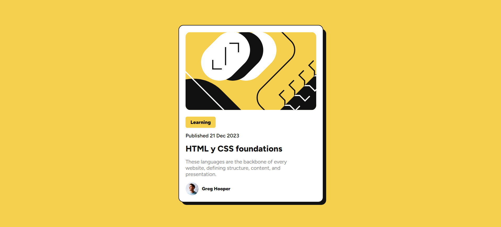

# Frontend Mentor - Blog preview card solution

This is a solution to the [Blog preview card challenge on Frontend Mentor](https://www.frontendmentor.io/challenges/blog-preview-card-ckPaj01IcS). Frontend Mentor challenges help you improve your coding skills by building realistic projects. 

## Table of contents

- [Overview](#overview)
  - [Screenshot](#screenshot)
  - [Links](#links)
- [My process](#my-process)
  - [Built with](#built-with)
  - [What I learned](#what-i-learned)
- [Author](#author)

## Overview

Desing blog card preview

### Screenshot

### Links

- Solution URL: [Solution](https://www.frontendmentor.io/solutions/blog-preview-card-responsive-with-position-css-LC77sa-fe9)
- Live Site URL: [View Solution](https://projects-html-css-js-hazel.vercel.app/frontend-mentor-solutions/blog-preview-card-main/index.html)

### Built with

- Semantic HTML5 markup
- CSS custom properties
- Flexbox
- Position CSS

### What I learned

I learned to understand how positioning works in CSS.

## Author

- Frontend Mentor - [@WillianArevalo](https://www.frontendmentor.io/profile/WillianArevalo)